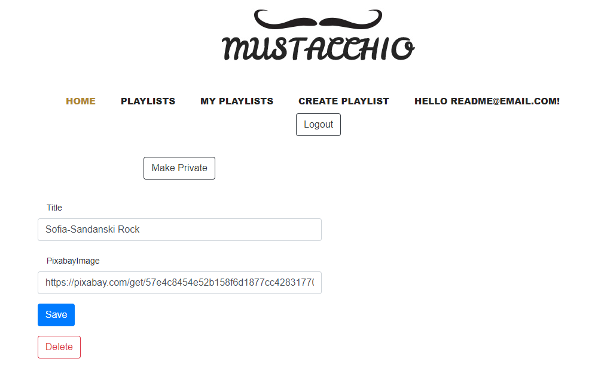

# [Link to Trello Board](https://trello.com/b/y3Y0tmIN/playlist-generator)

# [Link to Azure](https://team1ridepal.azurewebsites.net/)

# RidePal Playlist Generator

---

### Table of Contents
- [Description](#description)
- [How To Consume](#how-to-Consume)
- [Project Setup](#project-setup)
- [REST API](#rest-api)

---

## Description

 > RidePal Playlist Generator is a web application that enables our users to generate playlists for specific travel duration periods based on their preferred genres. 
 >
 >The application offers the option to browse playlists created by other users and
allows searching by title and filtering by total duration and genre tags.
 >
 >`Main Use case:` A user travelling from point A to point B wants to have something to listen to during the duration of the travel. The user wants to generate a track list based on his musical tastes.
 >
 >**`Public part:`** The public part is visible without authentication. This includes the application start page, the user login and user registration forms, as well as the list of all user generated playlists.
>
>**`Private part:`** People that are not authenticated cannot see any user specific details, neither they can interact with the website. They can only browse the playlists, see the tracks list and details of them and listen to the demo version of rach track.  
>Authenticated users have the ability to generate new playlists, control the generation algorithm and edit or delete their own existing playlists.  
>Editing existing playlists is limited to changing the title or associated genre
tags but does not include editing of the track list
>
>**`Admin part:`** System administrators can administer all major information objects in the system. On top of the regular user capabilities, the administrators have the following capabilities:
>* Able to edit/delete users and other administrators.
>* Able to edit/delete over the playlists.

#### Technologies

- [ASP.Net Core](https://docs.microsoft.com/en-us/aspnet/core/introduction-to-aspnet-core?view=aspnetcore-3.1)
- [Entity Framework Core](https://docs.microsoft.com/en-us/ef/core/)
- [SQL Server](https://www.microsoft.com/en-us/sql-server/sql-server-2019)
- [JavaScript](https://www.javascript.com/try)

[Back To The Top](#ridePal-playlist-generator)

---

# How To Consume
## Public part:
>### As a user the first steps are to Login / Register.
>
>
>### After successfully being authenticated you will be albe to ceate a playlist by specifying the start and end locations of your trip, the playlist's title and some percentage of a genre.
>
>
>### When the playlist finishes generating you will be redirected to `My Playlists`. Here you can browse all your generated playlists.
>
>
>### Here you can play the entire playlist just by selecting the play button on the center.  
>### On the left is displayed the name on the playlist, by who it was made, its rank (the average rank of all songs) and a paged list of all songs, their duration and preview link.
>### On the right you can control the volume, skip to next/previous track or just select a loaded track and play it.  
>### For editing a playlist click the `Edit` navigation link.
>
>
>### On the edit page you will be able to:
>- Make a playlist Public or Private.
>- Change its Title.
>- Change its icon link.
>- Delete it.  
>### After editing the Title or icon link the `Save` button must be clicked to save the changes, after saving it will redirect you to `My Playlists`. 
>
>
>### On the `Playlists` page are displayed all public playlists sorted by their rank. We can filter them by title, genre and/or duration.  
>- The search bar is used to search by title.
>- The dropdown next to the search bar allows us to select what genre we want to filter by.
>- The duration range filters by the playlists duration. The lowest you can select on the range slider is the shortest playlist, same goes for the highest you can select and longest playlist.
>
>
>
>
>### On the `Home` page the Top 3 playlists by ranking are displayed.
>

## Private part:
>### As an admin you can manage all user acces, even other admins. Navigate to `Users`
>
>
>### Admins also have the ability to delete other user's entire playlists, the delete button will only appear if an admin opens the playlist.
>

## Project Setup:
>### Change server name on appsettings.json
>
>
>### Run the following commands on `Package Manager Console` while default project is [PG.Data]() and startup project is PG.Web > PG.Web: "update-database"
>  

#### [Back To The Top](#ridePal-playlist-generator)
---
  
# REST API
>###  We used Swagger to implement and document our API, [you can access it through this link](http://localhost:5000/swagger/index.html) or by `/swagger/index.html`.
>  
>
>### To be able to use the API, authentication is needed. On the `Users` dropdown select `Authenticate` and then `Try it out`:
>  
>
>### Next step is to add your credentials and execute to get your Login token:
>  
>
>### Authentication is made by providing the token to the `Authorize` form:
>  
>
>### Now you can enjoy creating playlists:
>  

[Back To The Top](#ridePal-playlist-generator)

---
## References

[Deezer's API](https://developers.deezer.com/api)

[BingMaps's API](https://www.microsoft.com/en-us/maps/choose-your-bing-maps-api)

[Pixabay's API](https://pixabay.com/api/docs/)

[Google's API](https://developers.google.com/maps/documentation/javascript/overview)